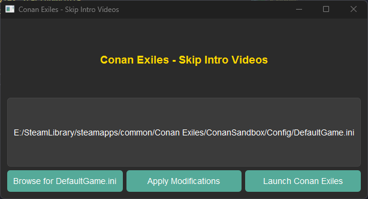

  # Conan Exiles Skip Intro Movies 📝  
  This script will edit the DefaultGame.ini file to disable the startup intro videos in Conan Exiles PC game.  
  
  ## Get Started 🚀  
  -  Start the app
  - Browse to the DefaultGame.ini file
  - Click the "Apply Modifications" button
  - Enjoy Conan without the intro movies
  
  ## Requirements
  - Python 3.11+
  - Install dependencies with this line:
    pip install -r requirements.txt
      
  ## Other Info ✨  
 This script should work on Windows, Mac, and Linux.
 A "ready to run" version is also included for Windows.

 Also included is a PowerShell script (ps_skip_intros.ps1) to accomplish the same thing.

## License
This project is licensed under the [MIT License](https://opensource.org/licenses/MIT).

## Screenshot
